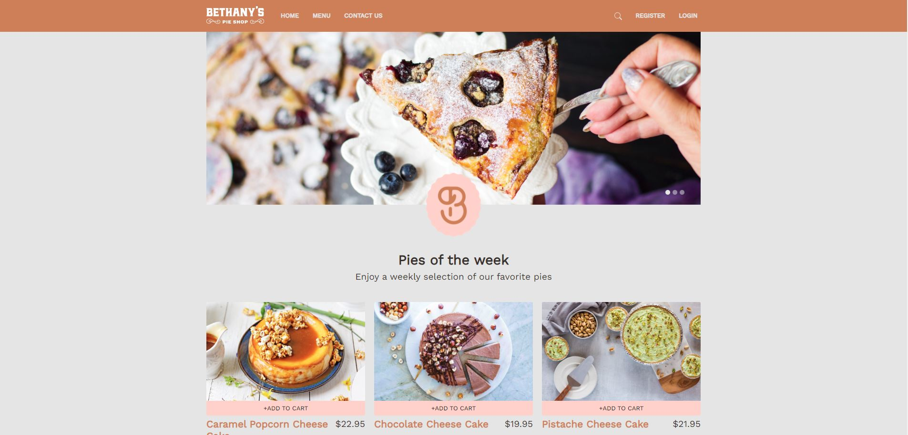
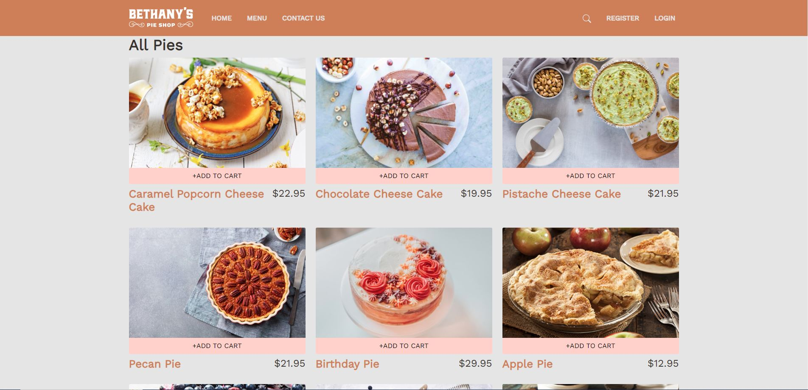
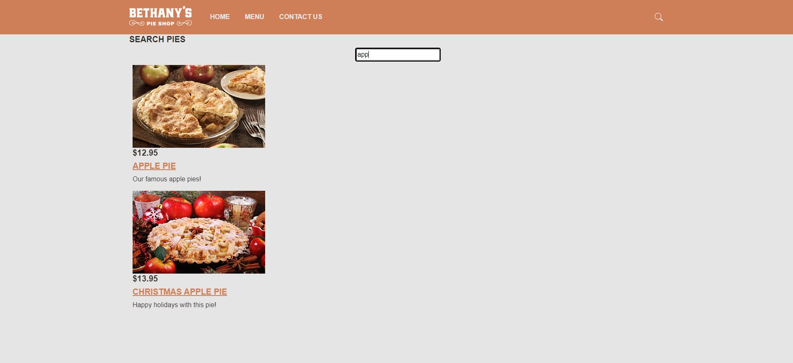
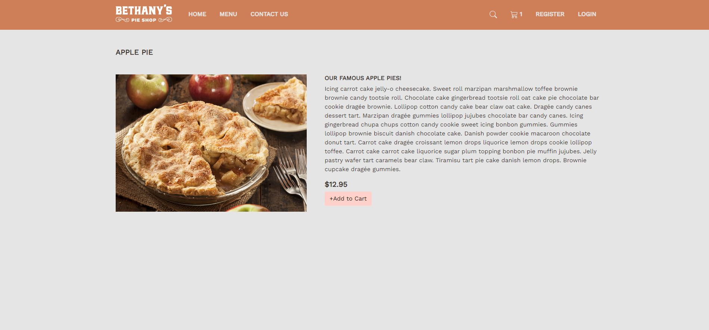
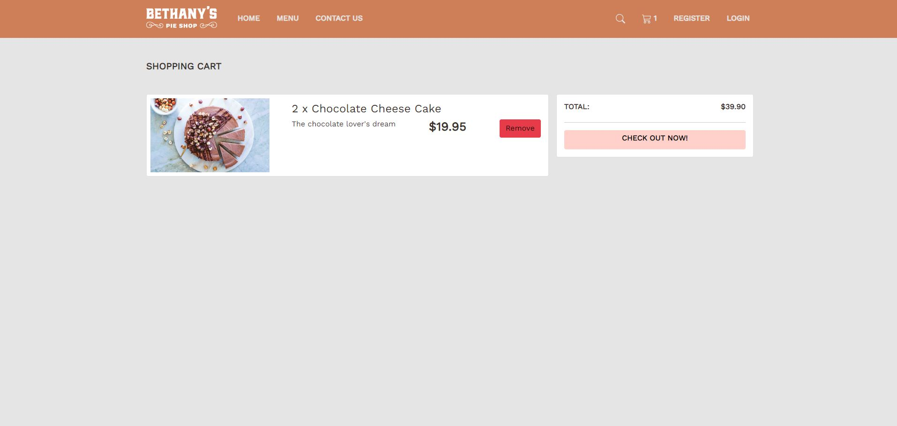
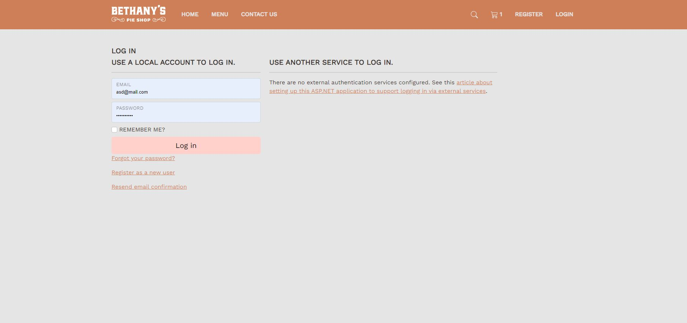
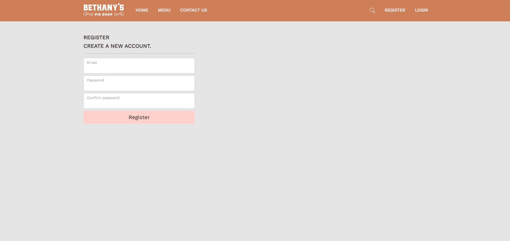
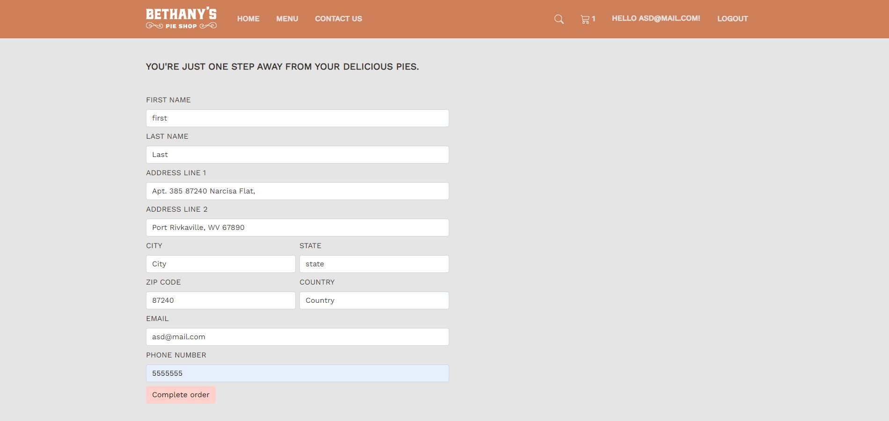
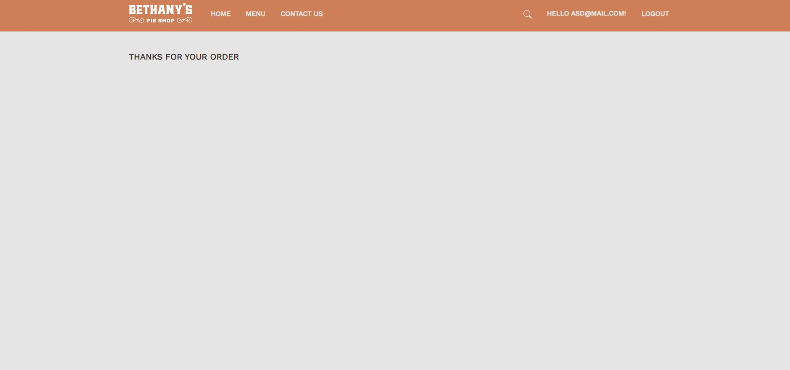

<h1 align="center">Welcome to Bethany Pie Shop 👋</h1>
<p>
  
  <a href="#" target="_blank">
    
  </a>
</p>

> Bethany Pie Shop , is an E-commerce website built with ASP.NET 

### ✨ [Live Demo] 
## Home Page

## Menu Page

## Search Page

## Pie Details page


## Cart page


## Login page


## Register page


## Checkout page


## OrderConfirmation page


## List All tasks and search 


## About Page


## Usage & Installs

```sh
 - Make sure to have .NET 8+
 - Make sure to install SQL Server Management Studio
 - Change the appsettings.json default connection string to your own
 - in the package manager console choose the default project as ProductStore.DataAccess then enter "add-migration init" then "update-database"
```


## Author

👤 **Ibrahim Alghofili**


## Show your support

Give a ⭐️ if this project helped you!

***
